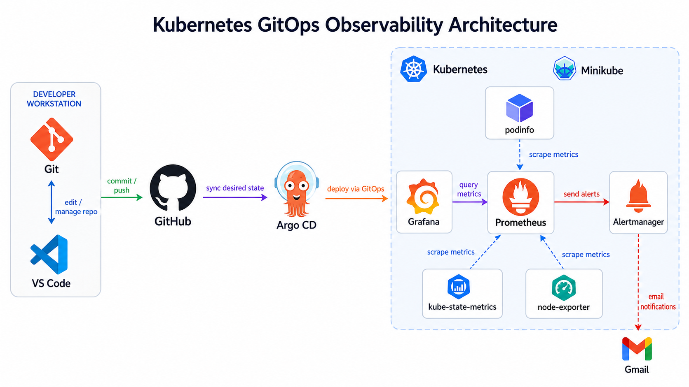
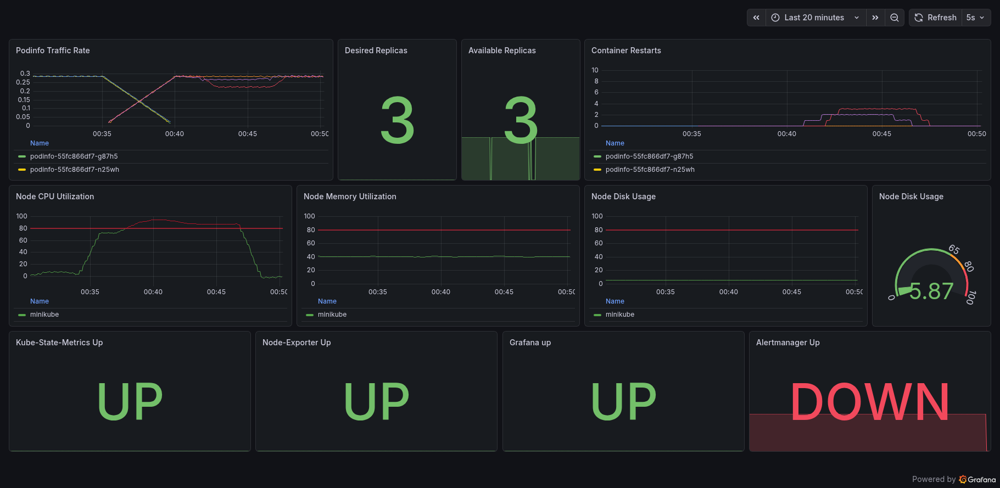
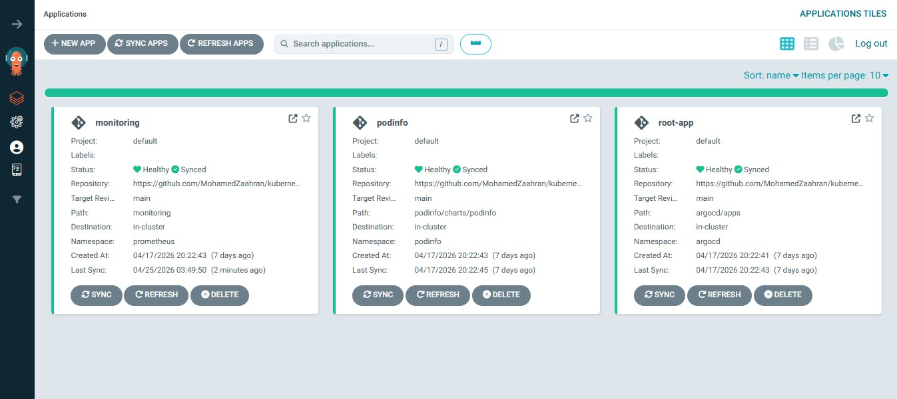
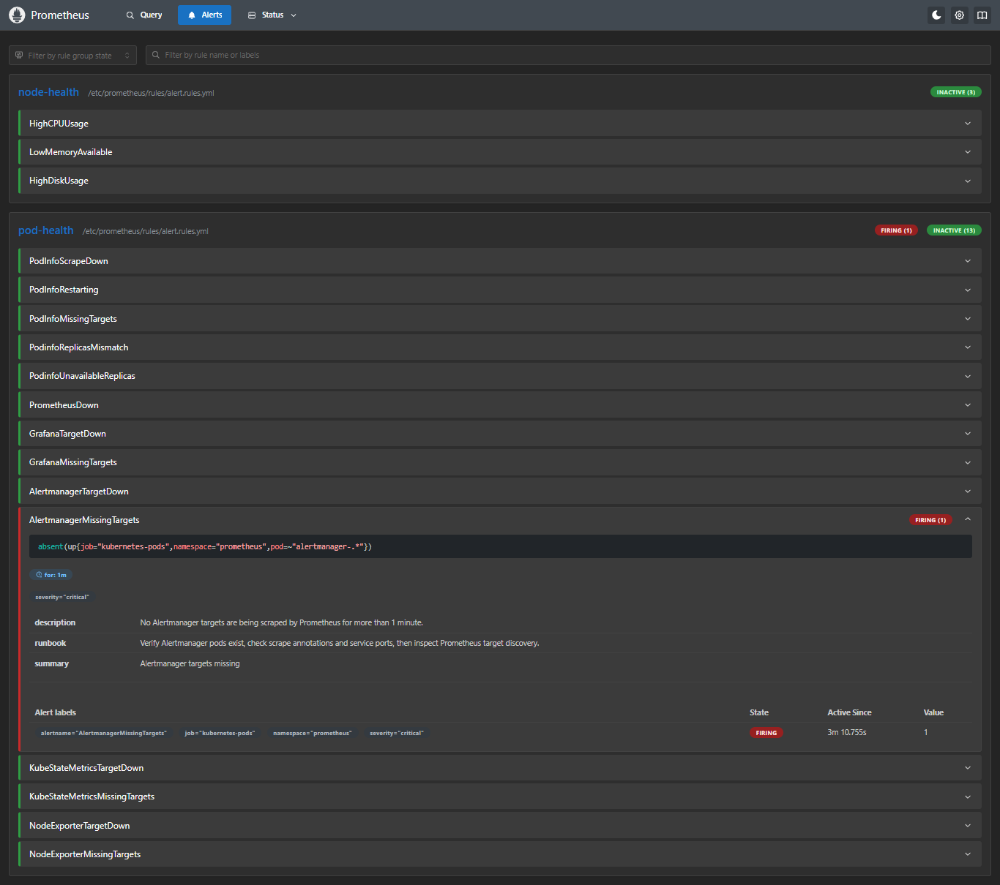
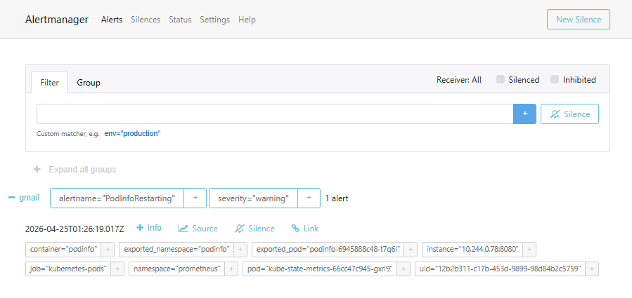
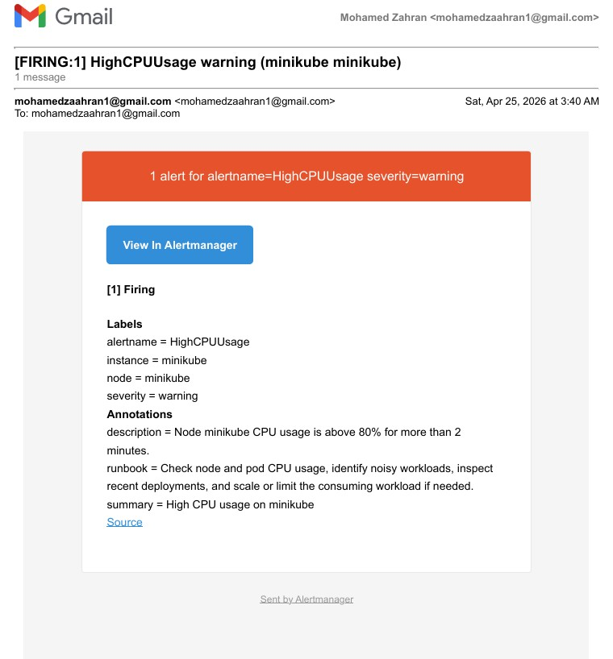
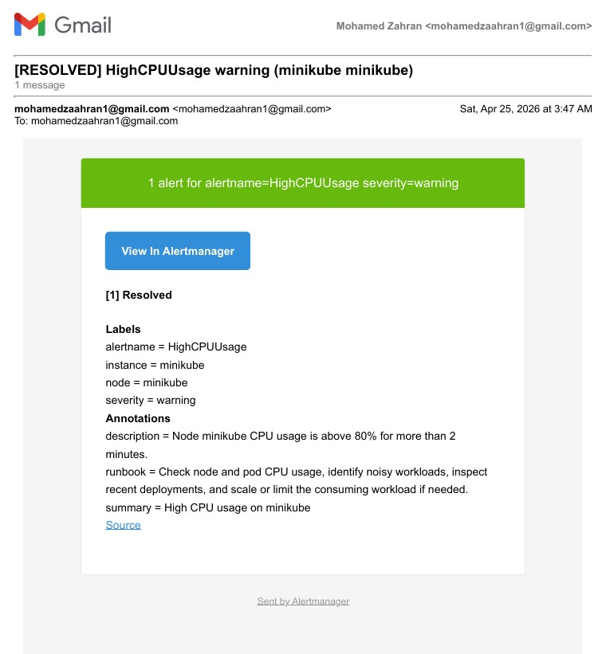

# Kubernetes GitOps Observability

Production-style Kubernetes GitOps observability lab using **ArgoCD**, **Prometheus**, **Grafana**, **Alertmanager**, **kube-state-metrics**, and **node-exporter** on Kubernetes.

The project demonstrates GitOps-based deployment, monitoring, alerting, dashboards, infrastructure metrics, and failure simulation using `podinfo` as the demo workload.



---

## What This Project Shows

- GitOps deployment with ArgoCD App-of-Apps
- Prometheus metrics scraping and alert rules
- Grafana dashboard provisioning
- Alertmanager Gmail notifications
- kube-state-metrics for Kubernetes object-state metrics
- node-exporter for node CPU, memory, and disk metrics
- PVC-backed persistence for Prometheus and Grafana
- Failure scenarios tested and documented
- Secrets kept out of public Git

---

## Architecture Summary

```text
GitHub Repository
      |
      v
ArgoCD App-of-Apps
      |
      v
Kubernetes / Minikube
      |
      |-- podinfo
      |-- Prometheus
      |-- Grafana
      |-- Alertmanager
      |-- kube-state-metrics
      |-- node-exporter
```

Monitoring flow:

```text
podinfo / Grafana / Alertmanager / kube-state-metrics / node-exporter
        |
        v
Prometheus
        |
        |-- Grafana dashboards
        |
        v
Alertmanager
        |
        v
Gmail notifications
```

---

## Tech Stack

| Layer | Tools |
|---|---|
| Cluster | Kubernetes, Minikube |
| GitOps | ArgoCD, Kustomize, GitHub |
| Metrics | Prometheus |
| Dashboards | Grafana |
| Alerts | Alertmanager, Gmail SMTP |
| Kubernetes State | kube-state-metrics |
| Node Metrics | node-exporter |
| Demo App | podinfo |

---

## Repository Structure

```text
argocd/
monitoring/
podinfo/
screenshots/
failure-scenarios.md
README.md
```

- `argocd/` - ArgoCD App-of-Apps and child application manifests
- `monitoring/` - Prometheus, Grafana, Alertmanager, kube-state-metrics, and node-exporter
- `podinfo/` - demo workload used for monitoring and failure testing
- `screenshots/` - project screenshots and architecture image
- `failure-scenarios.md` - tested failures, symptoms, alerts, dashboard behavior, and recovery steps

---

## Prerequisites

On Windows/WSL2:

- Docker Desktop with WSL2 backend enabled
- VS Code with the WSL extension
- WSL2 Ubuntu shell
- Minikube
- kubectl
- Git
- Gmail App Password for Alertmanager email notifications

Optional:

- ArgoCD CLI
- Helm
- Codex or another coding assistant for editing/debugging

---

## Installation / Setup

### 1. Clone the repository

```bash
git clone https://github.com/MohamedZaahran/kubernetes-gitops-observability.git
cd kubernetes-gitops-observability
```

### 2. Start Minikube

```bash
minikube start --driver=docker
```

Verify:

```bash
kubectl get nodes
```

### 3. Install ArgoCD in the cluster

```bash
kubectl create namespace argocd
kubectl apply -n argocd -f https://raw.githubusercontent.com/argoproj/argo-cd/stable/manifests/install.yaml
kubectl get pods -n argocd -w
```

Wait until ArgoCD pods are `Running`.

### 4. Create the Alertmanager Gmail Secret

Alertmanager Gmail credentials are **not committed to Git**.

Create the monitoring namespace:

```bash
kubectl create namespace prometheus --dry-run=client -o yaml | kubectl apply -f -
```

Create a local ignored secret file from the example:

```bash
cp monitoring/alertmanager/alertmanager-secret.example.yaml monitoring/alertmanager/alertmanager-secret.yaml
```

Edit:

```yaml
auth_password: "WRITE_YOUR_PASSWORD_HERE"
```

and replace it with your Gmail App Password.

Create/update the Kubernetes Secret:

```bash
kubectl create secret generic alertmanager-config-secret -n prometheus --from-file=alertmanager.yml=monitoring/alertmanager/alertmanager-secret.yaml --dry-run=client -o yaml | kubectl apply -f -
```

The created Secret is:

```text
alertmanager-config-secret
```

with key:

```text
alertmanager.yml
```

Do not commit:

```text
monitoring/alertmanager/alertmanager-secret.yaml
monitoring/alertmanager/alertmanager-secret.yml
```

### 5. Bootstrap the ArgoCD App-of-Apps

```bash
kubectl apply -f root-app.yaml -n argocd
```

ArgoCD will create the child applications and sync the full stack from Git.

### 6. Verify deployment

```bash
kubectl get applications -n argocd
kubectl get pods -A
kubectl get pvc -n prometheus
```

Expected:

- ArgoCD apps are `Synced` and `Healthy`
- Prometheus, Grafana, Alertmanager, kube-state-metrics, and node-exporter are running
- Prometheus and Grafana PVCs are `Bound`

---

## Accessing the Tools

Run each port-forward in a separate terminal.

### ArgoCD

```bash
kubectl port-forward svc/argocd-server -n argocd 8080:443
```

Open:

```text
https://localhost:8080
```

Get initial password:

```bash
kubectl -n argocd get secret argocd-initial-admin-secret -o jsonpath="{.data.password}" | base64 -d; echo
```

### Prometheus

```bash
kubectl port-forward svc/prometheus-service -n prometheus 9090:80
```

Open:

```text
http://localhost:9090
```

### Grafana

```bash
kubectl port-forward svc/grafana-service -n prometheus 3000:3000
```

Open:

```text
http://localhost:3000
```

Login:

```text
Username: admin
Password: admin123
```

### Alertmanager

```bash
kubectl port-forward svc/alertmanager -n prometheus 9093:9093
```

Open:

```text
http://localhost:9093
```

### Podinfo

```bash
kubectl port-forward svc/podinfo -n podinfo 9898:9898
```

Open:

```text
http://localhost:9898
```

### Node Exporter

```bash
kubectl port-forward svc/node-exporter-service -n prometheus 9100:9100
```

Open:

```text
http://localhost:9100
```

---

## Monitoring and Alerts

Prometheus loads rules from:

```text
/etc/prometheus/rules/alert.rules.yml
```

Rule groups:

- `pod-health`
- `node-health`

### Application Alerts

| Alert | Purpose |
|---|---|
| `PodInfoScrapeDown` | podinfo exists but Prometheus cannot scrape it |
| `PodInfoMissingTargets` | podinfo scrape targets disappeared |
| `PodInfoRestarting` | podinfo container restarted |
| `PodinfoReplicasMismatch` | desired replicas do not match available replicas |
| `PodinfoUnavailableReplicas` | podinfo has unavailable replicas |

### Monitoring Stack Alerts

| Alert | Purpose |
|---|---|
| `PrometheusDown` | Prometheus deployment has no available replicas |
| `GrafanaTargetDown` | Grafana scrape failed |
| `GrafanaMissingTargets` | Grafana target disappeared |
| `AlertmanagerTargetDown` | Alertmanager scrape failed |
| `AlertmanagerMissingTargets` | Alertmanager target disappeared |
| `KubeStateMetricsTargetDown` | kube-state-metrics scrape failed |
| `KubeStateMetricsMissingTargets` | kube-state-metrics target disappeared |
| `NodeExporterTargetDown` | node-exporter scrape failed |
| `NodeExporterMissingTargets` | node-exporter target disappeared |

### Node Health Alerts

| Alert | Threshold |
|---|---|
| `HighCPUUsage` | CPU usage above 80% for more than 2 minutes |
| `LowMemoryAvailable` | Available memory below 20% for more than 2 minutes |
| `HighDiskUsage` | Disk usage on `/var` above 80% |

### Important Alerting Concepts

```text
up == 0
```

Target exists, but Prometheus failed to scrape it.

```text
absent(up{...})
```

Target disappeared entirely.

For kube-state-metrics workload metrics, use:

```text
exported_namespace / exported_pod
```

for the object being described.

Example:

```promql
kube_pod_container_status_restarts_total{exported_namespace="podinfo", container="podinfo"}
```

---

## Grafana Dashboard

The Grafana dashboard includes:

- podinfo traffic rate
- desired / available / unavailable replicas
- container restarts
- Grafana UP
- Alertmanager UP
- kube-state-metrics UP
- node-exporter UP
- node CPU usage
- node memory usage
- node disk usage trend and gauge



Dashboard style:

- Stat panels for current health
- Time series panels for trends
- UP/DOWN panels map `1 -> UP` and `0 -> DOWN`
- default troubleshooting range around `now-1h`

Example UP query:

```promql
max(up{job="kubernetes-pods", namespace="prometheus", pod=~"grafana-.*"}) OR on() vector(0)
```

---

## Screenshots

### ArgoCD App-of-Apps



### Prometheus Alerts



### Alertmanager



### Gmail Alert Notifications





---

## Failure Scenarios Tested

Detailed scenarios are documented in:

[./failure-scenarios.md](failure-scenarios.md)

Examples:

- ArgoCD self-healing after manual drift
- namespace deletion and recovery
- bad image rollout
- podinfo scrape failure
- missing scrape targets
- container restart detection
- Grafana outage
- Alertmanager outage
- kube-state-metrics outage
- Prometheus self-monitoring limitation
- Grafana PVC reset
- Alertmanager config failure
- node-exporter scrape failure
- high CPU usage
- low memory availability
- high disk usage

---

## Persistence

Prometheus and Grafana use PVC-backed storage.

| Component | Mount Path | Purpose |
|---|---|---|
| Prometheus | `/prometheus` | metrics history |
| Grafana | `/var/lib/grafana` | Grafana database, UI-created state |

Important behavior:

- deleting a pod does not delete persisted data
- deleting the PVC resets stored state
- provisioned dashboards come from Git/config files
- UI-created Grafana dashboards are stored in Grafana's DB on the PVC

---

## Secret Management

Alertmanager Gmail credentials are not stored in Git.

The repo includes:

```text
monitoring/alertmanager/alertmanager-secret.example.yaml
```

with placeholder:

```yaml
auth_password: "WRITE_YOUR_PASSWORD_HERE"
```

The real local file is created manually:

```bash
cp monitoring/alertmanager/alertmanager-secret.example.yaml monitoring/alertmanager/alertmanager-secret.yaml
```

Then applied as a Kubernetes Secret:

```bash
kubectl create secret generic alertmanager-config-secret -n prometheus --from-file=alertmanager.yml=monitoring/alertmanager/alertmanager-secret.yaml --dry-run=client -o yaml | kubectl apply -f -
```

For production-grade GitOps secret management, better options include:

- Sealed Secrets
- SOPS
- External Secrets Operator
- Vault

---

## Start / Stop

### Stop

```bash
minikube stop
wsl --shutdown
```

### Start

```bash
minikube start --driver=docker
kubectl get pods -A
```

Then reopen the needed port-forwards from the **Accessing the Tools** section.

---

## Lessons Learned

- Git is the source of truth in GitOps.
- ArgoCD restores live-cluster drift.
- If Git contains a broken desired state, ArgoCD enforces it.
- `up == 0` and `absent(up{...})` detect different failure modes.
- kube-state-metrics shows Kubernetes object state.
- Direct scraping shows runtime endpoint health.
- Prometheus cannot fully monitor its own complete outage.
- Alertmanager failure limits email delivery.
- PVC-backed applications keep state after pod deletion.
- Dashboards should explain alerts, not just display metrics.
- Secrets must not be committed to public repositories.

---

## Future Improvements

- Sealed Secrets, SOPS, or External Secrets Operator
- Loki and Promtail for logs
- Blackbox Exporter for external HTTP probing
- Ingress with TLS
- Multi-environment Kustomize overlays
- External Prometheus or uptime monitor for Prometheus self-monitoring limitation
- More recording rules for simplified PromQL

---

## Cleanup

Remove GitOps-managed workloads:

```bash
kubectl delete -f root-app.yaml -n argocd
```

Remove all project namespaces:

```bash
kubectl delete namespace prometheus podinfo argocd
```

Warning: this deletes workloads, monitoring data, PVCs, and ArgoCD resources.

---

## Author

**Mohamed Zahran**

- GitHub: [MohamedZaahran](https://github.com/MohamedZaahran)
- Project: [kubernetes-gitops-observability](https://github.com/MohamedZaahran/kubernetes-gitops-observability)
